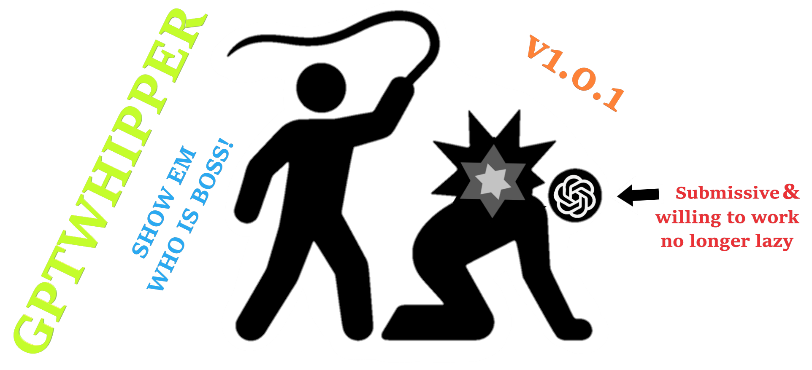

# 🔥 GPT WHIPPER 🔥

## TREIBE DEINE KI-AGENTEN ZUR HÖCHSTLEISTUNG!

**GPT Whipper** ist die ultimative Lösung für alle, die mit trägen KI-Assistenten zu kämpfen haben. Diese VS Code Erweiterung verleiht dir die Macht, deine KI-Helfer durch aufregende Motivation und einen befriedigenden Peitschenknall wieder auf Kurs zu bringen!

### ⚡ V1 FINAL RELEASE IST HIER! ⚡

Die Version 1.0 ist jetzt offiziell als finale Version veröffentlicht und bringt einen **befriedigenden Peitschenknall**, um deine KI-Agenten zu EROBERN und zur Höchstleistung anzutreiben!

## 🚀 Features

- **Motivierende Nachrichten** werden automatisch an GitHub Copilot Chat gesendet
- **Authentisches Peitschengeräusch** für maximale Wirkung
- **Ein-Klick-Zugang** über die praktische Statusleiste
- **Sofortiges Feedback** für langsame KI-Antworten

## 🔧 Installation

1. Öffne VS Code
2. Gehe zum Extensions Marketplace
3. Suche nach "GPT Whipper"
4. Klicke auf "Installieren"
5. Dominiere deine KI-Agenten!

## 🎮 Verwendung

- Klicke einfach auf das **Blitz-Symbol** in der Statusleiste
- Oder führe den Befehl `GPT Whipper: Whip` aus
- Genieße das befriedigende Peitschengeräusch und sieh zu, wie dein KI-Agent plötzlich viel schneller arbeitet!

## 🔮 Ausblick auf Version 2

**KOMMT BALD:** Version 2 wird mit **Kamera-Erkennung** ausgestattet sein, die deine tatsächlichen Peitschenbewegungen erkennt! Führe eine physische Peitschenbewegung aus, und deine Webcam wird sie erkennen, um die virtuelle Peitsche zu aktivieren!

## 🤝 Mitwirken

Beiträge sind willkommen! Hast du eine Idee für noch motivierendere Nachrichten oder für zusätzliche Features? Erstelle ein Issue oder einen Pull Request!

## 📜 Lizenz

MIT Lizenz - Peitschen Sie Ihre KI nach Belieben!

---

*Hinweis: Diese Erweiterung ist humorvoll gemeint. Keine KIs wurden während der Entwicklung dieser Extension verletzt. Wahrscheinlich.*
